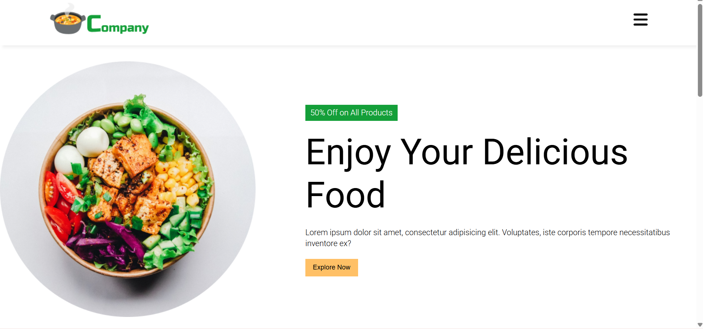

# 🍔 Online Food Order Website

A responsive **online food ordering website** built using **HTML and CSS**.  
This project focuses on creating a clean user interface for a food ordering platform with images, layout sections, and responsive design.

---

## 🚀 Technologies Used
- HTML
- CSS

---

## ✨ Features
- Responsive layout for desktop and mobile devices
- Attractive hero section with featured food items
- Food grid displaying different dishes with images
- Navigation bar and footer
- Clean and simple UI design
- Static front-end project (no backend)

---

## 📸 Screenshot

---

## ▶️ How to Run the Project
1. Download or clone the repository.
2. Open the project folder.
3. Double-click on **index.html**.
4. The website will open in your browser.

---

## 📂 Project Structure
online-food-order/  
│── index.html  
│── style.css  
│── hero_image.jpg  
│── delivery.jpg  
│── discount.jpg  
│── grid_image1.jpg  
│── grid_image2.jpg  
│── grid_image3.jpg  
│── grid_image4.jpg  
│── grid_image5.jpg  
│── grid_image6.jpg  
│── grid_image7.jpg  
│── logo.jpg  
│── README.md  

---

## 👩‍💻 Author
**Gayatri Deshmukh**  
Aspiring Web Developer 🚀

## 🌐 Live Demo

👉 https://online-food-order-iota.vercel.app/

